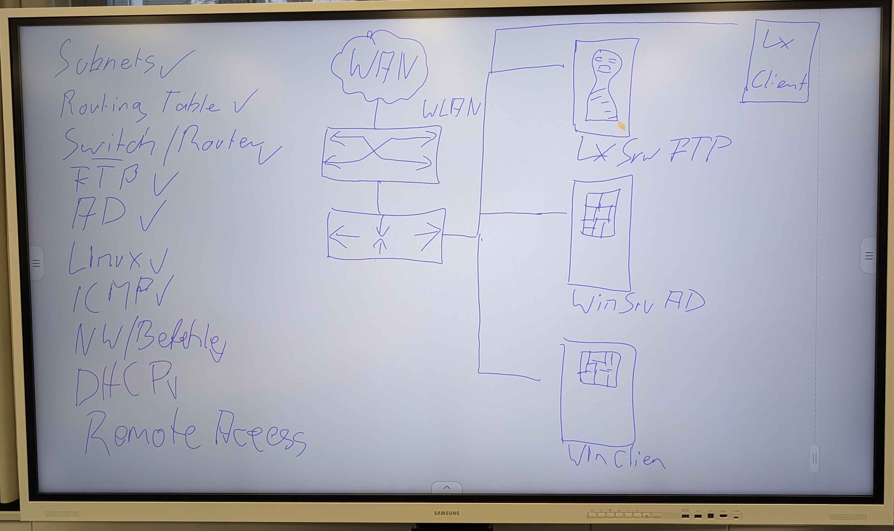
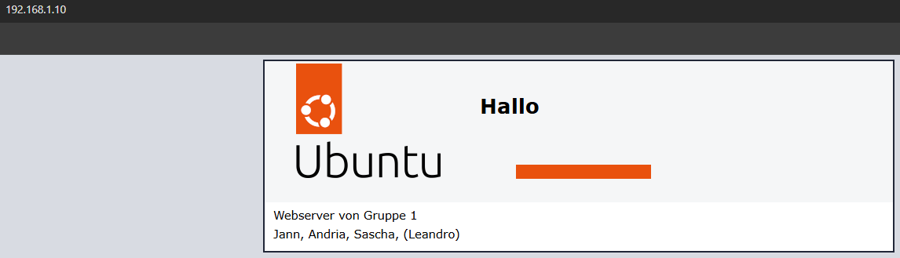

# Auftrag_31.01.25ZLI_DOKU

## Arbeitsauftrag

### Inhalt:

##### 1. Repository erstellen
##### 2. ISOs brennen
##### 3. Linux-Server und -Client aufsetzen
##### 4. Router konfigurieren
##### 5. Switch konfigurieren
##### 6. Linux-Server aufsetzen
##### 7. ProFTPD installieren
##### 8. Active Directory (AD) Server aufsetzen
##### 9. Webserver Apache2 installieren
##### 10. Linux-Client aufsetzen
##### 11. Windows-Client aufsetzen
##### 12. Beide Clients in AD aufnehmen

# Netzwerk-IP-Adressen

| IP-Adresse                  | Gerätetyp        | Hostname         |
|-----------------------------|------------------|------------------|
| 192.168.1.1                 | Router/Gateway  | RT01             |
| 192.168.1.2                 | Switch          | SW01             |
| 192.168.1.10                | Linux-Server    | linuxserver      |
| 192.168.1.11                | Windows-Server  | windowsserver    |
| Dynamic                     | Linux-Client    | linuxclient      |
| Dynamic                     | Windows-Client  | windowsclient    |
| 192.168.1.12 - 192.168.1.25 | Clients         | -                |
| 192.168.1.3 - 192.168.1.9   | Reserviert      | -                |

## 1. Repository erstellen
Zuerst erstellten wir unser Repository und fügten das gesamte Team als Collaborators hinzu. Danach begannen wir mit der Dokumentation, in der wir alle durchgeführten Schritte festhielten.

## 2. ISOs brennen
Nachdem das Repository erstellt wurde, begann Jann, die Linux-ISO-Images mithilfe von Rufus zu brennen, während Sascha die Windows-Images erstellte. Dadurch konnten wir alle benötigten Geräte neu aufsetzen.

## 3. Linux-Server und -Client aufsetzen
Anschließend setzte Jann den Linux-Server sowie den Client auf, mithilfe der zuvor gebrannten ISOs. Anfangs funktionierte dies nicht, und wir runzelten bereits die Stirn, bis Jörg uns darauf hinwies, das HDMI-Kabel nicht am Mainboard, sondern an der Grafikkarte anzuschließen.

## 4. Router konfigurieren
Als Nächstes begann Andrija mit der Konfiguration des Routers. Die IP-Adresse des Routers lautet nun **192.168.1.1**, mit dem Subnetz **255.255.255.0**.

## 5. Switch konfigurieren
Nach der Router-Konfiguration richtete Andrija auch gleich den Switch ein.

## 6. Linux-Server aufsetzen
Jann begann sofort mit dem Aufsetzen des Linux-Servers.

## 7. ProFTPD installieren
Danach installierte Jann den **ProFTPD-Server**, damit wir auf den Server zugreifen können.

## 8. Active Directory (AD) Server aufsetzen
Währenddessen setzte Sascha die **Active Directory (AD)** auf und konfigurierte alle notwendigen Einstellungen.

## 9. Webserver Apache2 installieren
Jann installierte den **Apache2-Webserver**, um einen funktionierenden Webserver bereitzustellen.  

## 10. Linux-Client aufsetzen
Nachdem dies erledigt war, wurde der **Linux-Client** eingerichtet.

## 11. Windows-Client aufsetzen
Parallel dazu setzte Sascha den **Windows-Client** auf.

## 12. Beide Clients in AD aufnehmen
Nachdem beide Clients aufgesetzt waren, nahmen wir sie in die **Active Directory** auf.
